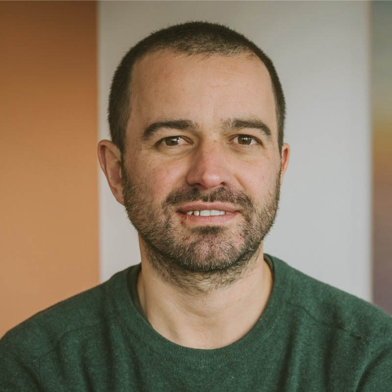

# About this website 

## Purpose of This Site

This website was created with the aim of spreading awareness about the concept of the **Dynamic Consistency Boundary** (DCB).

Our goals are threefold:

1. **Explain the rationale** behind the DCB approach.
2. **Provide a practical guide** for those who want to start applying it.
3. **Collect and organize** as many resources as possible on this topic.

This is a **non-commercial project**. We have no financial interest or sponsorship: our motivation is purely educational and driven by a desire to contribute to the tech community.

We believe DCB can be a significant step forward in the design and management of complex systems, and we want to help make it accessible to anyone interested.

---

## Who We Are

  

    
    <h3 style="margin: 10px 0 5px;">Bastian Waidelich</h3>
    
Selbständiger Software Architekt

    

      <a href="https://www.linkedin.com/in/bastian-waidelich-84865221">LinkedIn</a> |
      <a href="https://x.com/bwaidelich">Twitter/X</a>
    

  

  

    
    <h3 style="margin: 10px 0 5px;">Sara Pellegrini</h3>
    
Software Engineer, Continuous Learner, Free Thinker.

    

      <a href="https://www.linkedin.com/in/sara-pellegrini-55a37913">LinkedIn</a> |
      <a href="https://x.com/_sara_p_">Twitter/X</a>
    

  

  

    
    <h3 style="margin: 10px 0 5px;">Paul Grimshaw</h3>
    
Head of Tech for Generation | Kraken | Renewables

    

      <a href="https://www.linkedin.com/in/pkgrimshaw">LinkedIn</a> |
      <a href="https://x.com/">Twitter/X</a>
    

  

---

## Contact Us

For collaborations, suggestions, or just to connect, feel free to reach out to us through our social profiles!

---

> _This site is maintained with passion and commitment by a community of DCB enthusiasts._
