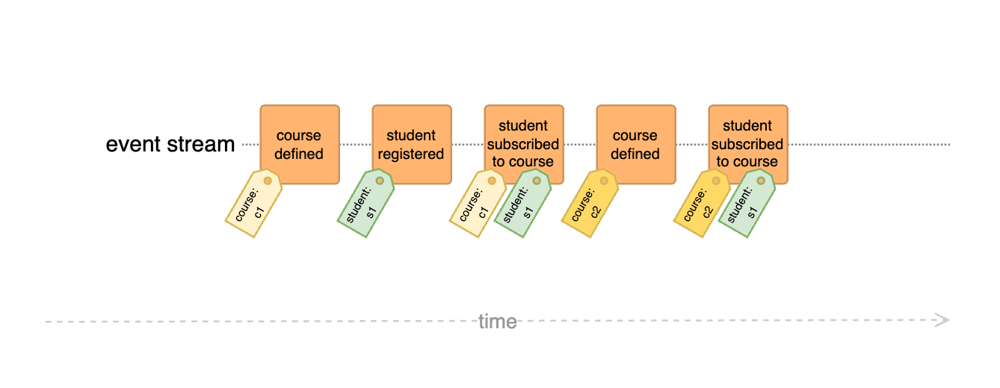

# Course subscription example

The following example showcases the imagined application from Sara Pellegrini's blog post "Killing the Aggregate" [:octicons-link-external-16:](https://sara.event-thinking.io/2023/04/kill-aggregate-chapter-1-I-am-here-to-kill-the-aggregate.html){:target="_blank" .small}

## Challenge

The goal is an application that allows students to subscribe to courses, with the following hard constraints:

- A course cannot accept more than N students
- N, the course capacity, can change at any time to any positive integer different from the current one
- The student cannot join more than 5 courses

## Traditional approaches

The first and last constraints, in particular, make this example difficult to implement using traditional Event Sourcing, as they cause the `student subscribed to course` Event to impact two separate entities, each with its own constraints.

There are several potential strategies to solve this without DCB:

- **Eventual consistency:** Turn one of the invariants into a *soft constraint*, i.e. use the <dfn title="Representation of data tailored for specific read operations, often denormalized for performance">Read Model</dfn> for verification and accept the fact that there might be overbooked courses and/or students with more than 5 subscriptions

    > :material-forward: This is of course a potential solution, with or without DCB, but it falls outside the scope of these examples

- **Larger Aggregate:** Create an Aggregate that spans course and student subscriptions

    > :material-forward: This is not a viable solution because it leads to huge Aggregates and restricts parallel bookings

- **Reservation Pattern:** Create an Aggregate for each, courses and students, enforcing their constraints and use a <dfn title="Coordinates a sequence of local transactions across multiple services, ensuring data consistency through compensating actions in case of failure">Saga</dfn> to coordinate them

    > :material-forward: This works, but it leads to a lot of complexity and potentially invalid states for a period of time

## DCB approach

With DCB the challenge can be solved simply by adding a [Tag](../specification.md#tag) for each, the affected course *and* student to the `StudentSubscribedToCourse` Event:



### Feature 1: Register courses

The first implementation just allows to specify new courses and make sure that they have a unique id:

```dcb id="course_subscription_01"
model "Course subscriptions"

tag type CourseId = string

event CourseDefined { tag courseId: CourseId, capacity: integer }

projection CourseExists (tag courseId: CourseId): boolean = false {
  on CourseDefined => set true
}

handler DefineCourse(courseId: CourseId, capacity: integer) {
  require CourseExists(courseId) is false
    else reject "Course already exists"
  emit CourseDefined { courseId, capacity }

  scenarios {
    scenario "Define course with existing id" {
      given CourseDefined { courseId: "c1", capacity: 10 }
      when DefineCourse { courseId: "c1", capacity: 15 }
      then rejected "Course already exists"
    }
    scenario "Define course with new id" {
      when DefineCourse { courseId: "c1", capacity: 15 }
      then CourseDefined { courseId: "c1", capacity: 15 }
    }
  }
}
```

### Feature 2: Change course capacity

The second implementation extends the first by a `ChangeCourseCapacity` command that allows to change the maximum number of seats for a given course:

```dcb id="course_subscription_02" extends="course_subscription_01"
event CourseCapacityChanged { tag courseId: CourseId, newCapacity: integer }

projection CourseCapacity (tag courseId: CourseId): integer = 0 {
  on CourseDefined => set event.data.capacity
  on CourseCapacityChanged => set event.data.newCapacity
}

handler ChangeCourseCapacity(courseId: CourseId, newCapacity: integer) {
  require CourseExists(courseId) is true
    else reject "Course does not exist"
  require CourseCapacity(courseId) != newCapacity
    else reject "Capacity is unchanged"
  emit CourseCapacityChanged { courseId, newCapacity }

  scenarios {
    scenario "Change capacity of a non-existing course" {
      when ChangeCourseCapacity { courseId: "c0", newCapacity: 15 }
      then rejected "Course does not exist"
    }
    scenario "Change capacity of a course to a new value" {
      given CourseDefined { courseId: "c1", capacity: 12 }
      when ChangeCourseCapacity { courseId: "c1", newCapacity: 15 }
      then CourseCapacityChanged { courseId: "c1", newCapacity: 15 }
    }
  }
}
```

### Feature 3: Subscribe student to course

The last implementation contains the core example that requires constraint checks across multiple entities, adding a `SubscribeStudentToCourse` command that checks...

- ...whether the course with the specified id exists
- ...whether the specified course still has available seats
- ...whether the student with the specified id is not yet subscribed to given course
- ...whether the student is not subscribed to more than 5 courses already

The "Consistency boundary" tab shows the resulting Query: it combines Query Items for Events tagged with the course (`CourseId:{courseId}`) and with the student (`StudentId:{studentId}`). Because the appended `StudentSubscribedToCourse` Event carries both Tags, a concurrent subscription to the same course *or* by the same student makes the `AppendCondition` fail:

```dcb id="course_subscription_03" extends="course_subscription_02"
tag type StudentId = string

event StudentSubscribedToCourse { tag studentId: StudentId, tag courseId: CourseId }

projection CourseSubscriptionCount (tag courseId: CourseId): integer = 0 {
  on StudentSubscribedToCourse => increment 1
}
projection StudentSubscriptionCount (tag studentId: StudentId): integer = 0 {
  on StudentSubscribedToCourse => increment 1
}
projection StudentAlreadySubscribed (tag studentId: StudentId, tag courseId: CourseId): boolean = false {
  on StudentSubscribedToCourse => set true
}

handler SubscribeStudentToCourse(studentId: StudentId, courseId: CourseId) {
  require CourseExists(courseId) is true
    else reject "Course does not exist"
  require CourseSubscriptionCount(courseId) < CourseCapacity(courseId)
    else reject "Course is full"
  require StudentAlreadySubscribed(studentId, courseId) is false
    else reject "Student is already subscribed"
  require StudentSubscriptionCount(studentId) < 5
    else reject "Student is subscribed to too many courses"

  emit StudentSubscribedToCourse { studentId, courseId }

  scenarios {
    scenario "Subscribe student to non-existing course" {
      when SubscribeStudentToCourse { studentId: "s1", courseId: "c0" }
      then rejected "Course does not exist"
    }
    scenario "Subscribe student to fully booked course" {
      given CourseDefined { courseId: "c1", capacity: 3 }
      given StudentSubscribedToCourse { studentId: "s1", courseId: "c1" }
      given StudentSubscribedToCourse { studentId: "s2", courseId: "c1" }
      given StudentSubscribedToCourse { studentId: "s3", courseId: "c1" }
      when SubscribeStudentToCourse { studentId: "s4", courseId: "c1" }
      then rejected "Course is full"
    }
    scenario "Subscribe student to the same course twice" {
      given CourseDefined { courseId: "c1", capacity: 10 }
      given StudentSubscribedToCourse { studentId: "s1", courseId: "c1" }
      when SubscribeStudentToCourse { studentId: "s1", courseId: "c1" }
      then rejected "Student is already subscribed"
    }
    scenario "Subscribe student to more than 5 courses" {
      given CourseDefined { courseId: "c6", capacity: 10 }
      given StudentSubscribedToCourse { studentId: "s1", courseId: "c1" }
      given StudentSubscribedToCourse { studentId: "s1", courseId: "c2" }
      given StudentSubscribedToCourse { studentId: "s1", courseId: "c3" }
      given StudentSubscribedToCourse { studentId: "s1", courseId: "c4" }
      given StudentSubscribedToCourse { studentId: "s1", courseId: "c5" }
      when SubscribeStudentToCourse { studentId: "s1", courseId: "c6" }
      then rejected "Student is subscribed to too many courses"
    }
    scenario "Subscribe student to course with capacity" {
      given CourseDefined { courseId: "c1", capacity: 10 }
      when SubscribeStudentToCourse { studentId: "s1", courseId: "c1" }
      then StudentSubscribedToCourse { studentId: "s1", courseId: "c1" }
    }
  }
}
```

### Other implementations

There is a working `JavaScript/TypeScript`[:octicons-link-external-16:](https://github.com/sennentech/dcb-event-sourced/tree/main/examples/course-manager-cli){:target="_blank" .small} and `PHP`[:octicons-link-external-16:](https://github.com/bwaidelich/dcb-example-courses){:target="_blank" .small} implementation of this example

## Conclusion

The course subscription example demonstrates a typical requirement to enforce consistency that affects multiple entities that are not part of the same Aggregate. This document demonstrates how easy it is to achieve that with DCB
