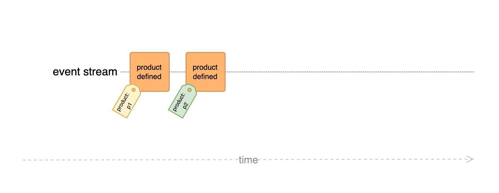
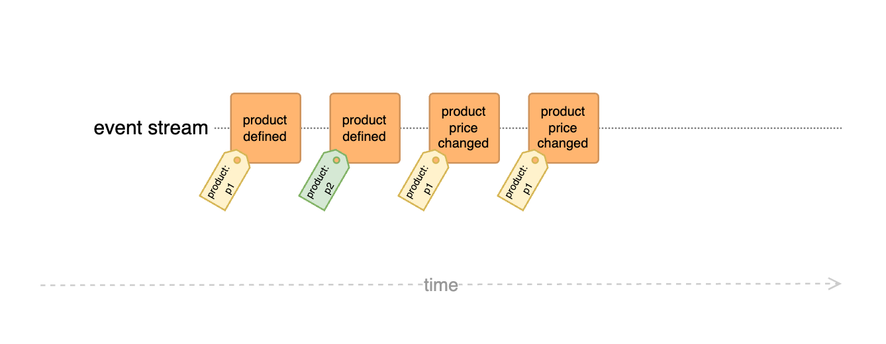

# Dynamic product price validation

The following example showcases a simple application that allows to purchase products, with a twist

## Challenge

The goal is an application that allows customers to purchase products, ensuring that the displayed price is taken into account – if it is valid:

- The product prices that are shown to the customer must be used for processing the order
- If a displayed product price is not/no longer valid, the order must fail
- Product prices can be changed at any time
- If a product price was changed, the previous price(s) must be valid for a configurable grace period

## Traditional approaches

There are several potential strategies to solve this without DCB:

- **Aggregate Pattern:** For the single product use case an <dfn title="Cluster of associated objects that we treat as a unit for the purpose of data changes (see related article)">Aggregates</dfn> could be used

    > :material-forward: That only works if product change and -purchase Events are stored in the same Event Stream, which is unlikely to be a good idea

- **Eventual consistency:** Use the <dfn title="Representation of data tailored for specific read operations, often denormalized for performance">Read Model</dfn> to verify the prices in the command handler

    > :material-forward: That works, but the last requirement (changing prices) forces the model to keep track of historic data even though there might be no (other) use case for it to be kept. A separate, dedicated, model could be created of course but that adds complexity

## DCB approach

With DCB the challenge can be solved without any specific [Tags](../specification.md#tag) (except for the `product:<id>` tag):

### 01: Single product

If only a single product with a fixed price can be purchased at a time, the implementation is pretty simple:



```js
// event type definitions:

class ProductDefined {
  type = "ProductDefined"
  data
  tags
  constructor({ productId, price }) {
    this.data = { productId, price }
    this.tags = [`product:${productId}`]
  }
}

class ProductOrdered {
  type = "ProductOrdered"
  data
  tags
  constructor({ productId, price }) {
    this.data = { productId, price }
    this.tags = [`product:${productId}`]
  }
}

// projections for decision models:

class ProductPriceProjection {
  static for(productId) {
    return createProjection({
      initialState: 0,
      handlers: {
        ProductDefined: (state, event) => event.data.price,
      },
      tags: [`product:${productId}`],
    })
  }
}

// command handlers:

class Api {
  eventStore
  constructor(eventStore) {
    this.eventStore = eventStore
  }

  orderProduct(command) {
    const { state, appendCondition } = buildDecisionModel(this.eventStore, {
      productPrice: ProductPriceProjection.for(command.productId),
    })
    if (state.productPrice !== command.displayedPrice) {
      throw new Error(`invalid price for product "${command.productId}"`)
    }
    this.eventStore.append(
      new ProductOrdered({
        productId: command.productId,
        price: command.displayedPrice,
      }),
      appendCondition
    )
  }
}

// test cases:

const eventStore = new InMemoryDcbEventStore()
const api = new Api(eventStore)
runTests(api, eventStore, [
  {
    description: "Order product with invalid displayed price",
    given: {
      events: [new ProductDefined({ productId: "p1", price: 123 })],
    },
    when: {
      command: {
        type: "orderProduct",
        data: { productId: "p1", displayedPrice: 100 },
      },
    },
    then: {
      expectedError: 'invalid price for product "p1"',
    },
  },
  {
    description: "Order product with valid displayed price",
    given: {
      events: [new ProductDefined({ productId: "p1", price: 123 })],
    },
    when: {
      command: {
        type: "orderProduct",
        data: { productId: "p1", displayedPrice: 123 },
      },
    },
    then: {
      expectedEvent: new ProductOrdered({ productId: "p1", price: 123 }),
    },
  },
])
```

<codapi-snippet engine="browser" sandbox="javascript" template="/assets/js/lib2.js"></codapi-snippet>

### 02: Changing product prices

Complexity increases if the product price can be changed and previous prices shall be valid for a specified amount of time:



!!! note

    The `minutesAgo` property of the Event metadata is a simplification. Typically, a timestamp representing the Event's recording time is stored within the Event's payload or metadata. This timestamp can be compared to the current date to determine the Event's age in the decision model.

```js hl_lines="37-54 73-76"
// event type definitions:

class ProductDefined {
  type = "ProductDefined"
  data
  tags
  constructor({ productId, price }) {
    this.data = { productId, price }
    this.tags = [`product:${productId}`]
  }
}

class ProductPriceChanged {
  type = "ProductPriceChanged"
  data
  tags
  constructor({ productId, newPrice }) {
    this.data = { productId, newPrice }
    this.tags = [`product:${productId}`]
  }
}

class ProductOrdered {
  type = "ProductOrdered"
  data
  tags
  constructor({ productId, price }) {
    this.data = { productId, price }
    this.tags = [`product:${productId}`]
  }
}

// projections for decision models:

class ProductPriceProjection {
  static for(productId) {
    const productPriceGracePeriod = 10
    return createProjection({
      initialState: { lastValidOldPrice: null, validNewPrices: [] },
      handlers: {
        ProductDefined: (state, event) =>
          event.metadata.minutesAgo <= productPriceGracePeriod
            ? { lastValidOldPrice: null, validNewPrices: [event.data.price] }
            : { lastValidOldPrice: event.data.price, validNewPrices: [] },
        ProductPriceChanged: (state, event) =>
          event.metadata.minutesAgo <= productPriceGracePeriod
            ? {
                lastValidOldPrice: state.lastValidOldPrice,
                validNewPrices: [...state.validNewPrices, event.data.newPrice],
              }
            : {
                lastValidOldPrice: event.data.newPrice,
                validNewPrices: state.validNewPrices,
              },
      },
      tags: [`product:${productId}`],
    })
  }
}

// command handlers:

class Api {
  eventStore
  constructor(eventStore) {
    this.eventStore = eventStore
  }

  orderProduct(command) {
    const { state, appendCondition } = buildDecisionModel(this.eventStore, {
      productPrice: ProductPriceProjection.for(command.productId),
    })
    if (
      state.productPrice.lastValidOldPrice !== command.displayedPrice &&
      !state.productPrice.validNewPrices.includes(command.displayedPrice)
    ) {
      throw new Error(`invalid price for product "${command.productId}"`)
    }
    this.eventStore.append(
      new ProductOrdered({
        productId: command.productId,
        price: command.displayedPrice,
      }),
      appendCondition
    )
  }
}

// test cases:

const eventStore = new InMemoryDcbEventStore()
const api = new Api(eventStore)

function addMetadata(event, metadata) {
  return Object.assign(event, {
    metadata,
  })
}

runTests(api, eventStore, [
  {
    description: "Order product with a displayed price that was never valid",
    given: {
      events: [
        addMetadata(new ProductDefined({ productId: "p1", price: 123 }), {
          minutesAgo: 20,
        }),
      ],
    },
    when: {
      command: {
        type: "orderProduct",
        data: { productId: "p1", displayedPrice: 100 },
      },
    },
    then: {
      expectedError: 'invalid price for product "p1"',
    },
  },
  {
    description:
      "Order product with a price that was changed more than 10 minutes ago",
    given: {
      events: [
        addMetadata(new ProductDefined({ productId: "p1", price: 123 }), {
          minutesAgo: 20,
        }),
        addMetadata(
          new ProductPriceChanged({ productId: "p1", newPrice: 134 }),
          {
            minutesAgo: 20,
          }
        ),
      ],
    },
    when: {
      command: {
        type: "orderProduct",
        data: { productId: "p1", displayedPrice: 123 },
      },
    },
    then: {
      expectedError: 'invalid price for product "p1"',
    },
  },
  {
    description: "Order product with initial valid price",
    given: {
      events: [
        addMetadata(new ProductDefined({ productId: "p1", price: 123 }), {
          minutesAgo: 20,
        }),
      ],
    },
    when: {
      command: {
        type: "orderProduct",
        data: { productId: "p1", displayedPrice: 123 },
      },
    },
    then: {
      expectedEvent: new ProductOrdered({
        productId: "p1",
        price: 123,
      }),
    },
  },
  {
    description:
      "Order product with a price that was changed less than 10 minutes ago",
    given: {
      events: [
        addMetadata(new ProductDefined({ productId: "p1", price: 123 }), {
          minutesAgo: 20,
        }),
        addMetadata(
          new ProductPriceChanged({ productId: "p1", newPrice: 134 }),
          {
            minutesAgo: 9,
          }
        ),
      ],
    },
    when: {
      command: {
        type: "orderProduct",
        data: { productId: "p1", displayedPrice: 123 },
      },
    },
    then: {
      expectedEvent: new ProductOrdered({
        productId: "p1",
        price: 123,
      }),
    },
  },
  {
    description: "Order product with valid new price",
    given: {
      events: [
        addMetadata(new ProductDefined({ productId: "p1", price: 123 }), {
          minutesAgo: 20,
        }),
        addMetadata(
          new ProductPriceChanged({ productId: "p1", newPrice: 134 }),
          {
            minutesAgo: 9,
          }
        ),
      ],
    },
    when: {
      command: {
        type: "orderProduct",
        data: { productId: "p1", displayedPrice: 134 },
      },
    },
    then: {
      expectedEvent: new ProductOrdered({
        productId: "p1",
        price: 134,
      }),
    },
  },
])
```

<codapi-snippet engine="browser" sandbox="javascript" template="/assets/js/lib2.js"></codapi-snippet>

### 03: Multiple products (shopping cart)

The previous stages could be implemented with a traditional Event-Sourced Aggregate in theory.
But with the requirement to be able to order *multiple products at once* with a dynamic price, the flexibility of DCB shines:

```js hl_lines="23-31 69-94"
// event type definitions:

class ProductDefined {
  type = "ProductDefined"
  data
  tags
  constructor({ productId, price }) {
    this.data = { productId, price }
    this.tags = [`product:${productId}`]
  }
}

class ProductPriceChanged {
  type = "ProductPriceChanged"
  data
  tags
  constructor({ productId, newPrice }) {
    this.data = { productId, newPrice }
    this.tags = [`product:${productId}`]
  }
}

class ProductsOrdered {
  type = "ProductsOrdered"
  data
  tags
  constructor({ items }) {
    this.data = { items }
    this.tags = items.map((item) => `product:${item.productId}`)
  }
}

// projections for decision models:

class ProductPriceProjection {
  static for(productId) {
    const productPriceGracePeriod = 10
    return createProjection({
      initialState: { lastValidOldPrice: null, validNewPrices: [] },
      handlers: {
        ProductDefined: (state, event) =>
          event.metadata.minutesAgo <= productPriceGracePeriod
            ? { lastValidOldPrice: null, validNewPrices: [event.data.price] }
            : { lastValidOldPrice: event.data.price, validNewPrices: [] },
        ProductPriceChanged: (state, event) =>
          event.metadata.minutesAgo <= productPriceGracePeriod
            ? {
                lastValidOldPrice: state.lastValidOldPrice,
                validNewPrices: [...state.validNewPrices, event.data.newPrice],
              }
            : {
                lastValidOldPrice: event.data.newPrice,
                validNewPrices: state.validNewPrices,
              },
      },
      tags: [`product:${productId}`],
    })
  }
}

// command handlers:

class Api {
  eventStore
  constructor(eventStore) {
    this.eventStore = eventStore
  }

  orderProducts(command) {
    const { state, appendCondition } = buildDecisionModel(
      this.eventStore,
      command.items.reduce((models, item) => {
        models[item.productId] = ProductPriceProjection.for(item.productId)
        return models
      }, {})
    )
    for (const item of command.items) {
      if (
        state[item.productId].lastValidOldPrice !== item.displayedPrice &&
        !state[item.productId].validNewPrices.includes(item.displayedPrice)
      ) {
        throw new Error(`invalid price for product "${item.productId}"`)
      }
    }

    this.eventStore.append(
      new ProductsOrdered({
        items: command.items.map((item) => ({
          productId: item.productId,
          price: item.displayedPrice,
        })),
      }),
      appendCondition
    )
  }
}

// test cases:

const eventStore = new InMemoryDcbEventStore()
const api = new Api(eventStore)

function addMetadata(event, metadata) {
  return Object.assign(event, {
    metadata,
  })
}

runTests(api, eventStore, [
  {
    description: "Order product with a displayed price that was never valid",
    given: {
      events: [
        addMetadata(new ProductDefined({ productId: "p1", price: 123 }), {
          minutesAgo: 20,
        }),
      ],
    },
    when: {
      command: {
        type: "orderProducts",
        data: { items: [{ productId: "p1", displayedPrice: 100 }] },
      },
    },
    then: {
      expectedError: 'invalid price for product "p1"',
    },
  },
  {
    description:
      "Order product with a price that was changed more than 10 minutes ago",
    given: {
      events: [
        addMetadata(new ProductDefined({ productId: "p1", price: 123 }), {
          minutesAgo: 20,
        }),
        addMetadata(
          new ProductPriceChanged({ productId: "p1", newPrice: 134 }),
          {
            minutesAgo: 20,
          }
        ),
      ],
    },
    when: {
      command: {
        type: "orderProducts",
        data: { items: [{ productId: "p1", displayedPrice: 123 }] },
      },
    },
    then: {
      expectedError: 'invalid price for product "p1"',
    },
  },
  {
    description: "Order product with initial valid price",
    given: {
      events: [
        addMetadata(new ProductDefined({ productId: "p1", price: 123 }), {
          minutesAgo: 20,
        }),
      ],
    },
    when: {
      command: {
        type: "orderProducts",
        data: { items: [{ productId: "p1", displayedPrice: 123 }] },
      },
    },
    then: {
      expectedEvent: new ProductsOrdered({
        items: [
          {
            productId: "p1",
            price: 123,
          },
        ],
      }),
    },
  },
  {
    description:
      "Order product with a price that was changed less than 10 minutes ago",
    given: {
      events: [
        addMetadata(new ProductDefined({ productId: "p1", price: 123 }), {
          minutesAgo: 20,
        }),
        addMetadata(
          new ProductPriceChanged({ productId: "p1", newPrice: 134 }),
          {
            minutesAgo: 9,
          }
        ),
      ],
    },
    when: {
      command: {
        type: "orderProducts",
        data: { items: [{ productId: "p1", displayedPrice: 123 }] },
      },
    },
    then: {
      expectedEvent: new ProductsOrdered({
        items: [
          {
            productId: "p1",
            price: 123,
          },
        ],
      }),
    },
  },
  {
    description: "Order multiple products with valid prices",
    given: {
      events: [
        addMetadata(new ProductDefined({ productId: "p1", price: 123 }), {
          minutesAgo: 20,
        }),
        addMetadata(
          new ProductPriceChanged({ productId: "p1", newPrice: 134 }),
          {
            minutesAgo: 9,
          }
        ),
        addMetadata(new ProductDefined({ productId: "p2", price: 321 }), {
          minutesAgo: 8,
        }),
      ],
    },
    when: {
      command: {
        type: "orderProducts",
        data: {
          items: [
            { productId: "p1", displayedPrice: 123 },
            { productId: "p2", displayedPrice: 321 },
          ],
        },
      },
    },
    then: {
      expectedEvent: new ProductsOrdered({
        items: [
          {
            productId: "p1",
            price: 123,
          },
          {
            productId: "p2",
            price: 321,
          },
        ],
      }),
    },
  },
])
```

<codapi-snippet engine="browser" sandbox="javascript" template="/assets/js/lib2.js"></codapi-snippet>

## Conclusion

This example demonstrates the possibility to enforce consistency for a very dynamic set of entities