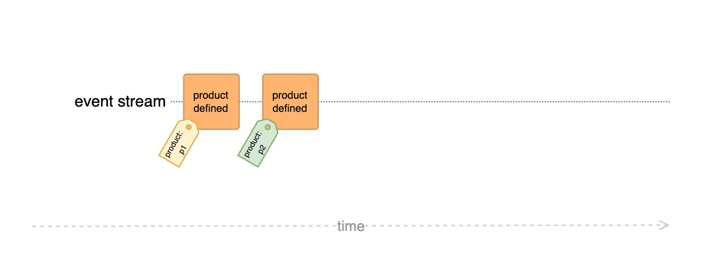
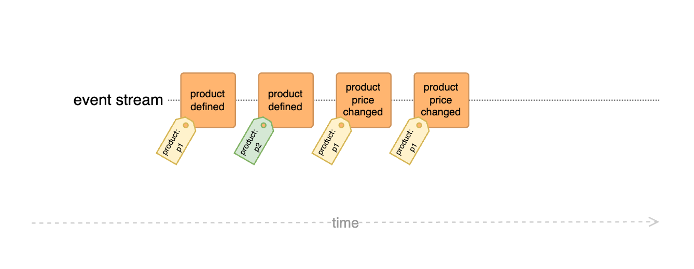

# Dynamic product price validation

The following example showcases a simple application that allows to purchase products, with a twist

## Challenge

The goal is an application that allows customers to purchase products, ensuring that the displayed price is taken into account – if it is valid:

- The product prices that are shown to the customer must be used for processing the order
- If a displayed product price is not/no longer valid, the order must fail
- Product prices can be changed at any time
- If a product price was changed, the previous price(s) must be valid for a configurable grace period

## Traditional approaches

There are several potential strategies to solve this without DCB:

- **Aggregate Pattern:** For the single product use case an <dfn title="Cluster of associated objects that we treat as a unit for the purpose of data changes (see related article)">Aggregates</dfn> could be used

    > :material-forward: That only works if product change and -purchase Events are stored in the same Event Stream, which is unlikely to be a good idea

- **Eventual consistency:** Use the <dfn title="Representation of data tailored for specific read operations, often denormalized for performance">Read Model</dfn> to verify the prices in the command handler

    > :material-forward: That works, but the last requirement (changing prices) forces the model to keep track of historic data even though there might be no (other) use case for it to be kept. A separate, dedicated, model could be created of course but that adds complexity

## DCB approach

With DCB the challenge can be solved without any specific [Tags](../specification.md#tag) (except for the `ProductId:<id>` tag):

### Feature 1: Order single product

If only a single product with a fixed price can be purchased at a time, the implementation is pretty simple:



The `OrderProduct` command compares the displayed price with the current price of the product and only records the order if they match. As the "Consistency boundary" tab shows, the Query only covers `ProductDefined` Events tagged with the ordered product's `ProductId`:

```dcb id="dynamic_product_price_01"
model "Dynamic product price"

tag type ProductId = string
type Money = number { minimum: 0 }

event ProductDefined { tag productId: ProductId, price: Money }
event ProductOrdered { tag productId: ProductId, price: Money }

projection ProductPrice (tag productId: ProductId): Money = null {
  on ProductDefined => set event.data.price
}

command OrderProduct(productId: ProductId, displayedPrice: Money) {
  require ProductPrice(productId) == displayedPrice
    else reject "Price has changed"

  emit ProductOrdered { productId, price: displayedPrice }

  scenarios {
    scenario "Order product with invalid displayed price" {
      given ProductDefined { productId: "p1", price: 123 }
      when OrderProduct { productId: "p1", displayedPrice: 100 }
      then rejected "Price has changed"
    }

    scenario "Order product with valid displayed price" {
      given ProductDefined { productId: "p1", price: 123 }
      when OrderProduct { productId: "p1", displayedPrice: 123 }
      then ProductOrdered { productId: "p1", price: 123 }
    }
  }
}
```

### Feature 2: Changing product prices

Complexity increases if the product price can be changed and previous prices shall be valid for a specified amount of time:



The `ProductPrice` projection now determines all prices that are valid at the time of the order: the price that was in effect 10 minutes ago, and every price that was set since then. Because that depends on the age of each Event, it is written as a scripted projection that takes the current time (`now`) after its Tag. The Query now covers `ProductPriceChanged` Events, too – so a price change that happens in the meantime makes the order fail.

!!! note

    The playground has neither a clock nor Event metadata, so time is part of the data in this example: `ProductDefined` and `ProductPriceChanged` carry the minute they were recorded at (`at`), and the `OrderProduct` command is passed the current minute (`now`). Typically, a timestamp representing the Event's recording time is stored within the Event's payload or metadata, and it is compared to the current date to determine the Event's age in the decision model.

````dcb id="dynamic_product_price_02" extends="dynamic_product_price_01"
model "Dynamic product price (grace period)"

type Minute = integer

event ProductDefined { tag productId: ProductId, price: Money, at: Minute }
event ProductPriceChanged { tag productId: ProductId, newPrice: Money, at: Minute }

projection ProductPrice (tag productId: ProductId, now: Minute): Money[] {
  script
  initialState []
  on ProductDefined => ```[event.data.price]```
  on ProductPriceChanged => ```args.now - event.data.at <= 10 ? [...state, event.data.newPrice] : [event.data.newPrice]```
}

command OrderProduct(productId: ProductId, displayedPrice: Money, now: Minute) {
  require ProductPrice(productId, now) contains displayedPrice
    else reject "Price is no longer valid"

  emit ProductOrdered { productId, price: displayedPrice }

  scenarios {
    scenario "Order product with invalid displayed price" {
      given ProductDefined { productId: "p1", price: 123, at: 100 }
      when OrderProduct { productId: "p1", displayedPrice: 100, now: 100 }
      then rejected "Price is no longer valid"
    }

    scenario "Order product with valid displayed price" {
      given ProductDefined { productId: "p1", price: 123, at: 100 }
      when OrderProduct { productId: "p1", displayedPrice: 123, now: 100 }
      then ProductOrdered { productId: "p1", price: 123 }
    }

    scenario "Order product with a displayed price that was never valid" {
      given ProductDefined { productId: "p1", price: 123, at: 80 }
      when OrderProduct { productId: "p1", displayedPrice: 100, now: 100 }
      then rejected "Price is no longer valid"
    }

    scenario "Order product with a price that was changed more than 10 minutes ago" {
      given ProductDefined { productId: "p1", price: 123, at: 80 }
      given ProductPriceChanged { productId: "p1", newPrice: 134, at: 80 }
      when OrderProduct { productId: "p1", displayedPrice: 123, now: 100 }
      then rejected "Price is no longer valid"
    }

    scenario "Order product with initial valid price" {
      given ProductDefined { productId: "p1", price: 123, at: 80 }
      when OrderProduct { productId: "p1", displayedPrice: 123, now: 100 }
      then ProductOrdered { productId: "p1", price: 123 }
    }

    scenario "Order product with a price that was changed less than 10 minutes ago" {
      given ProductDefined { productId: "p1", price: 123, at: 80 }
      given ProductPriceChanged { productId: "p1", newPrice: 134, at: 91 }
      when OrderProduct { productId: "p1", displayedPrice: 123, now: 100 }
      then ProductOrdered { productId: "p1", price: 123 }
    }

    scenario "Order product with valid new price" {
      given ProductDefined { productId: "p1", price: 123, at: 80 }
      given ProductPriceChanged { productId: "p1", newPrice: 134, at: 91 }
      when OrderProduct { productId: "p1", displayedPrice: 134, now: 100 }
      then ProductOrdered { productId: "p1", price: 134 }
    }
  }
}
````

### Feature 3: Multiple products (shopping cart)

The previous stages could be implemented with a traditional Event-Sourced Aggregate in theory.
But with the requirement to be able to order *multiple products at once* with a dynamic price, the flexibility of DCB shines.

The `OrderProducts` command replaces `OrderProduct`: it reads the `ProductPrice` projection once for every item in the cart (`each items.productId`) and checks each displayed price against the valid prices of that product. The "Consistency boundary" tab shows the result: one Query Item per ordered product, and a `ProductsOrdered` Event that is tagged with the `ProductId` of every product it contains. All products are covered by a single decision – if the price of any of them changes in the meantime, the whole order fails:

````dcb id="dynamic_product_price_03" extends="dynamic_product_price_02" removes="command OrderProduct, event ProductOrdered"
model "Dynamic product price (shopping cart)"

record Item { productId: ProductId, price: Money }

event ProductsOrdered { items: Item[] tag each productId }

command OrderProducts(items: Item[], now: Minute) {
  require ProductPrice(each items.productId, now) contains items.price
    else reject "Price is no longer valid"

  emit ProductsOrdered { items }

  scenarios {
    scenario "Order product with a displayed price that was never valid" {
      given ProductDefined { productId: "p1", price: 123, at: 80 }
      when OrderProducts { items: [{ productId: "p1", price: 100 }], now: 100 }
      then rejected "Price is no longer valid"
    }

    scenario "Order product with a price that was changed more than 10 minutes ago" {
      given ProductDefined { productId: "p1", price: 123, at: 80 }
      given ProductPriceChanged { productId: "p1", newPrice: 134, at: 80 }
      when OrderProducts { items: [{ productId: "p1", price: 123 }], now: 100 }
      then rejected "Price is no longer valid"
    }

    scenario "Order product with initial valid price" {
      given ProductDefined { productId: "p1", price: 123, at: 80 }
      when OrderProducts { items: [{ productId: "p1", price: 123 }], now: 100 }
      then ProductsOrdered { items: [{ productId: "p1", price: 123 }] }
    }

    scenario "Order product with a price that was changed less than 10 minutes ago" {
      given ProductDefined { productId: "p1", price: 123, at: 80 }
      given ProductPriceChanged { productId: "p1", newPrice: 134, at: 91 }
      when OrderProducts { items: [{ productId: "p1", price: 123 }], now: 100 }
      then ProductsOrdered { items: [{ productId: "p1", price: 123 }] }
    }

    scenario "Order multiple products with valid prices" {
      given ProductDefined { productId: "p1", price: 123, at: 80 }
      given ProductPriceChanged { productId: "p1", newPrice: 134, at: 91 }
      given ProductDefined { productId: "p2", price: 321, at: 92 }
      when OrderProducts { items: [{ productId: "p1", price: 123 }, { productId: "p2", price: 321 }], now: 100 }
      then ProductsOrdered { items: [{ productId: "p1", price: 123 }, { productId: "p2", price: 321 }] }
    }
  }
}
````

## Conclusion

This example demonstrates the possibility to enforce consistency for a very dynamic set of entities