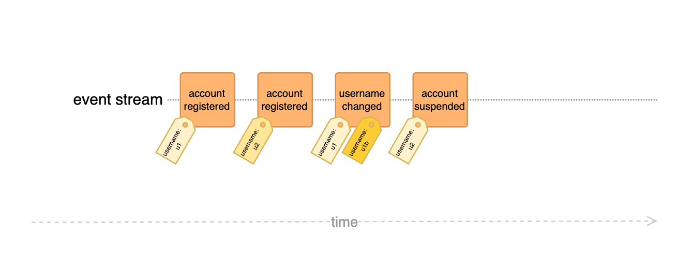

# Unique username example

Enforcing globally unique values is simple with strong consistency (thanks to tools like unique constraint indexes), but it becomes significantly more challenging with <dfn title="Consistency model that prioritizes availability and partition tolerance over immediate consistency">eventual consistency</dfn>.

## Challenge

The goal is an application that allows users to subscribe with a username that uniquely identifies them.

As a bonus, this example is extended by adding the following features:

- Allow usernames to be re-claimed when the account was closed (see disclaimer!)
- Allow users to change their username
- Only release unused usernames after a configurable delay

## Traditional approaches

There are a couple of common strategies to achieve global uniqueness in event-driven systems:

- **Eventual consistency**: Use a <dfn title="Representation of data tailored for specific read operations, often denormalized for performance">Read Model</dfn> to check for uniqueness and handle a duplication due to race conditions after the fact (e.g. by deactivating the account or changing the username)

     > :material-forward: This is of course a potential solution, with or without DCB, but it falls outside the scope of these examples

- **Dedicated storage**: Create a dedicated storage for allocated usernames and make the write side insert a record when the corresponding Event is recorded
    
      > :material-forward: This adds a source of error and potentially locked usernames unless Event and storage update can be done in a single transaction

- **Reservation Pattern:** Use the <dfn title="Design pattern used to temporarily hold or reserve a resource or state until the process is completed">Reservation Pattern</dfn> to lock a username and only continue if the locking succeeded

      > :material-forward: This works but adds quite a lot of complexity and additional Events and the need for <dfn title="Coordinates a sequence of local transactions across multiple services, ensuring data consistency through compensating actions in case of failure">Sagas</dfn> or multiple writes in a single request

## DCB approach

With DCB all Events that affect the unique constraint (the username in this example) can be tagged with the corresponding value (or a hash of it):



### Feature 1: Globally unique username

This example is the most simple one just checking whether a given username is claimed

```dcb id="unique_username_01"
model "Unique username"

tag type Username = string

event AccountRegistered { tag username: Username }

projection UsernameClaimed (tag username: Username): boolean = false {
  on AccountRegistered => set true
}

command RegisterAccount(username: Username) {
  alias claimed = UsernameClaimed(username)

  require claimed is false
    else reject "Username is already taken"

  emit AccountRegistered { username }

  scenarios {
    scenario "Register account with claimed username" {
      given AccountRegistered { username: "u1" }
      when RegisterAccount { username: "u1" }
      then rejected "Username is already taken"
    }

    scenario "Register account with unused username" {
      when RegisterAccount { username: "u1" }
      then AccountRegistered { username: "u1" }
    }
  }
}
```

!!! note

    To keep the example simple, we use the `username` directly as value for the Tag (e.g. `Username:u1`). In a real implementation, you probably would want to hash the value. And, more importantly, normalize it such that the usernames `jamesbond` and `JamesBond` are considered equal

### Feature 2: Release usernames

This example extends the previous one to show how a previously claimed username could be released when the corresponding account is closed

!!! warning "Disclaimer"
    It's most probably not a good idea to allow new users to take over the username of a closed account!
    Part 4 introduces a potential remedy, on its own this is merely an oversimplified example.

```dcb id="unique_username_02" extends="unique_username_01"
event AccountClosed { tag username: Username }

projection UsernameClaimed (tag username: Username): boolean = false {
  on AccountRegistered => set true
  on AccountClosed => set false
}

command RegisterAccount(username: Username) {
  alias claimed = UsernameClaimed(username)

  require claimed is false
    else reject "Username is already taken"

  emit AccountRegistered { username }

  scenarios {
    scenario "Register account with username of closed account" {
      given AccountRegistered { username: "u1" }
      given AccountClosed { username: "u1" }
      when RegisterAccount { username: "u1" }
      then AccountRegistered { username: "u1" }
    }
  }
}
```

### Feature 3: Allow changing of usernames

This example extends the previous one to show how the username of an active account could be changed.

The `UsernameChanged` Event is tagged with the old _and_ the new username, so it is part of the Query for both (see the "Consistency boundary" tab). A declarative handler cannot tell which of the two usernames it is folding, so the `UsernameClaimed` projection is scripted from here on: the change releases the old username and claims the new one.

````dcb id="unique_username_03" extends="unique_username_02"
event UsernameChanged { tag oldUsername: Username, tag newUsername: Username }

projection UsernameClaimed (tag username: Username): boolean {
  script
  initialState false
  on AccountRegistered => ```true```
  on AccountClosed => ```false```
  on UsernameChanged => ```event.data.newUsername === tags.username```
}

command RegisterAccount(username: Username) {
  alias claimed = UsernameClaimed(username)

  require claimed is false
    else reject "Username is already taken"

  emit AccountRegistered { username }

  scenarios {
    scenario "Register account with a username that was previously used and then changed" {
      given AccountRegistered { username: "u1" }
      given UsernameChanged { oldUsername: "u1", newUsername: "u1changed" }
      when RegisterAccount { username: "u1" }
      then AccountRegistered { username: "u1" }
    }

    scenario "Register account with a username that another username was changed to" {
      given AccountRegistered { username: "u1" }
      given UsernameChanged { oldUsername: "u1", newUsername: "u1changed" }
      when RegisterAccount { username: "u1changed" }
      then rejected "Username is already taken"
    }
  }
}
````

### Feature 4: Username retention

In the previous examples a username that is no longer claimed, can be used _immediately_ again for new accounts.
This example extends the previous one to show how a username can be reserved for a configurable amount of time before it is released.

!!! note

    The decision depends on the current date, so it is passed in with the command (`today`), and the Events record when they happened in their payload (`closedOn`, `changedOn`). That keeps the decision model deterministic: it compares the two to determine the Event's age. Representing dates as day numbers is a simplification, typically this would be a timestamp.

````dcb id="unique_username_04" extends="unique_username_03"
type Day = integer

event AccountClosed { tag username: Username, closedOn: Day }
event UsernameChanged { tag oldUsername: Username, tag newUsername: Username, changedOn: Day }

projection UsernameClaimed (tag username: Username, today: Day): boolean {
  script
  initialState false
  on AccountRegistered => ```true```
  on AccountClosed => ```args.today - event.data.closedOn <= 3```
  on UsernameChanged => ```event.data.newUsername === tags.username || args.today - event.data.changedOn <= 3```
}

command RegisterAccount(username: Username, today: Day) {
  alias claimed = UsernameClaimed(username, today)

  require claimed is false
    else reject "Username is already taken"

  emit AccountRegistered { username }

  scenarios {
    scenario "Register account with claimed username" {
      given AccountRegistered { username: "u1" }
      when RegisterAccount { username: "u1", today: 10 }
      then rejected "Username is already taken"
    }

    scenario "Register account with unused username" {
      when RegisterAccount { username: "u1", today: 10 }
      then AccountRegistered { username: "u1" }
    }

    scenario "Register account with username of closed account" {
      given AccountRegistered { username: "u1" }
      given AccountClosed { username: "u1", closedOn: 1 }
      when RegisterAccount { username: "u1", today: 10 }
      then AccountRegistered { username: "u1" }
    }

    scenario "Register account with a username that was previously used and then changed" {
      given AccountRegistered { username: "u1" }
      given UsernameChanged { oldUsername: "u1", newUsername: "u1changed", changedOn: 1 }
      when RegisterAccount { username: "u1", today: 10 }
      then AccountRegistered { username: "u1" }
    }

    scenario "Register account with a username that another username was changed to" {
      given AccountRegistered { username: "u1" }
      given UsernameChanged { oldUsername: "u1", newUsername: "u1changed", changedOn: 1 }
      when RegisterAccount { username: "u1changed", today: 10 }
      then rejected "Username is already taken"
    }

    scenario "Register username of closed account before retention period" {
      given AccountRegistered { username: "u1" }
      given AccountClosed { username: "u1", closedOn: 7 }
      when RegisterAccount { username: "u1", today: 10 }
      then rejected "Username is already taken"
    }

    scenario "Register changed username before retention period" {
      given AccountRegistered { username: "u1" }
      given UsernameChanged { oldUsername: "u1", newUsername: "u1changed", changedOn: 7 }
      when RegisterAccount { username: "u1", today: 10 }
      then rejected "Username is already taken"
    }

    scenario "Register username of closed account after retention period" {
      given AccountRegistered { username: "u1" }
      given AccountClosed { username: "u1", closedOn: 6 }
      when RegisterAccount { username: "u1", today: 10 }
      then AccountRegistered { username: "u1" }
    }

    scenario "Register changed username after retention period" {
      given AccountRegistered { username: "u1" }
      given UsernameChanged { oldUsername: "u1", newUsername: "u1changed", changedOn: 6 }
      when RegisterAccount { username: "u1", today: 10 }
      then AccountRegistered { username: "u1" }
    }
  }
}
````

## Conclusion

This example demonstrates how to solve one of the Event Sourcing evergreens: Enforcing unique usernames. But it can be applied to any scenario that requires global uniqueness of some sort.
