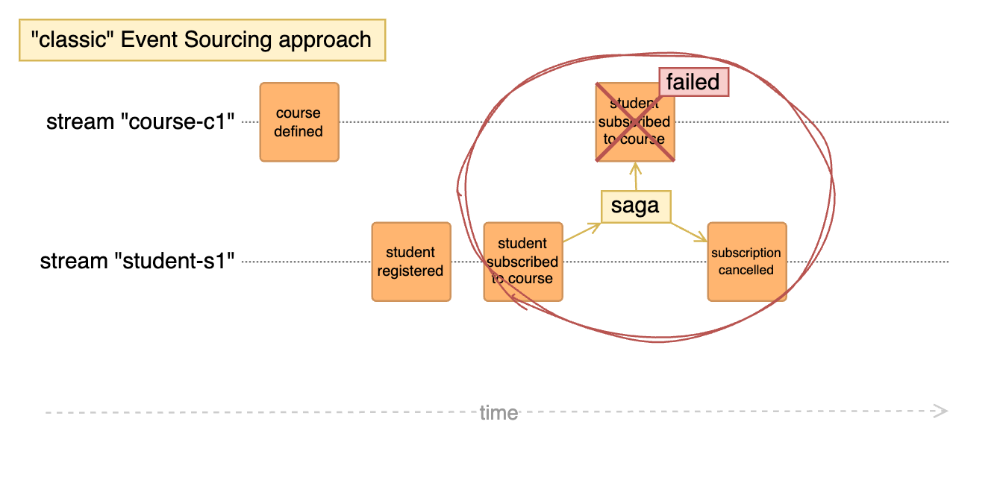

# What is it?

Dynamic Consistency Boundary (DCB) is a technique for enforcing consistency in event-driven systems without relying on rigid transactional boundaries.

Traditional systems use strict constraints to maintain immediate consistency, while event-driven architectures embrace eventual consistency for scalability and resilience. However, this flexibility raises challenges in defining where and how consistency should be enforced.

Introduced by Sara Pellegrini in her blog post "[Killing the Aggregate](https://sara.event-thinking.io/2023/04/kill-aggregate-chapter-1-I-am-here-to-kill-the-aggregate.html)", DCB provides a pragmatic approach to balancing strong consistency with flexibility. Unlike eventual consistency, which allows temporary inconsistencies across system components, DCB selectively enforces strong consistency where needed, particularly for operations spanning multiple entities. This ensures critical business processes and cross-entity invariants remain reliable while avoiding the constraints of traditional transactional models. By defining context-sensitive consistency boundaries, DCB helps teams optimize performance, scalability, and operational correctness.

## How it works

To illustrate how DCB works, it makes sense to first explain the "classic" Event Sourcing approach and its main issue:

In her blog post Sara describes an example application that allows students to subscribe to courses.
Restrictions apply to students and courses to ensure their integrity so it is obvious to implement these as [Aggregates](glossary.md#aggregate).

But then constraints are added that affect both entities, namely:

- a course cannot accept more than n students
- a student cannot subscribe to more than 10 courses

### Classic approach

Since it is impossible to update two aggregates with a single transaction, such requirements are usually solved with a [Saga](glossary.md#saga) that coordinates the process:

1. Mark student subscribed by publishing an event to the Event Stream of the student
2. If successful, mark seat in course reserved by publishing an event to the Event Stream of the affected course
3. If that fails due to constraint violations (e.g. because another student was subscribed to the same course in the meantime) append some compensating event to the student's Event Stream

This approach poses some issues in terms of added complexity and unwanted side-effects (e.g. the state of the system being incorrect for a short period of time).

But even for the happy path, the implementation leads to **two events** being published that represent **the same occurrence**.

### DCB approach

DCB solves this issue by allowing events to be tagged when they are published.
This allows one event to affect **multiple** entities/concepts in the system.

As a result, there is only a single global Event Stream and the example above can be simplified to:

## Getting started

Visit the [Examples](examples/index.md) section to explore various use cases for DCB.

The [Advanced topics](advanced/index.md) section provides in-depth articles on additional subjects related to DCB.

To begin using DCB, refer to the [libraries](libraries/index.md) section.