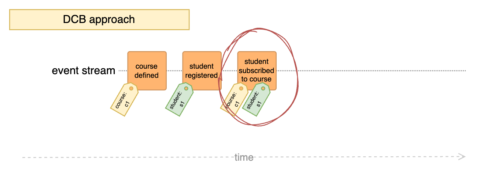

# What is it?

Dynamic Consistency Boundary (DCB) is a technique for enforcing consistency in event-driven systems without relying on rigid transactional boundaries.

Traditional systems use strict constraints to maintain immediate consistency, while event-driven architectures embrace eventual consistency for scalability and resilience. However, this flexibility raises challenges in defining where and how consistency should be enforced.

Introduced by Sara Pellegrini in her blog post "[Killing the Aggregate](https://sara.event-thinking.io/2023/04/kill-aggregate-chapter-1-I-am-here-to-kill-the-aggregate.html)", DCB provides a pragmatic approach to balancing strong consistency with flexibility. Unlike eventual consistency, which allows temporary inconsistencies across system components, DCB selectively enforces strong consistency where needed, particularly for operations spanning multiple entities. This ensures critical business processes and cross-entity invariants remain reliable while avoiding the constraints of traditional transactional models. By defining context-sensitive consistency boundaries, DCB helps teams optimize performance, scalability, and operational correctness.

## How it works

To illustrate how DCB works, it makes sense to first explain the traditional Event Sourcing approach and its main issue:

In her blog post Sara describes an example application that allows students to subscribe to courses.
Restrictions apply to students and courses to ensure their integrity so it is obvious to implement these as [Aggregates](glossary.md#aggregate).

But then constraints are added that affect both entities, namely:

- a course cannot accept more than n students
- a student cannot subscribe to more than 10 courses

### Traditional approach

Since it is impossible to update two aggregates with a single transaction, such requirements are usually solved with a [Saga](glossary.md#saga) that coordinates the process:

1. Mark student subscribed by publishing an event to the Event Stream of the student
2. If successful, mark seat in course reserved by publishing an event to the Event Stream of the affected course
3. If that fails due to constraint violations (e.g. because another student was subscribed to the same course in the meantime) append some compensating event to the student's Event Stream


This approach poses some issues in terms of added complexity and unwanted side-effects (e.g. the state of the system being incorrect for a short period of time).

But even for the happy path, the implementation leads to **two events** being published that represent **the same occurrence**.

### DCB approach

DCB solves this issue by allowing events to be tagged when they are published.
This allows one event to affect **multiple** entities/concepts in the system.

As a result, there is only a single global Event Stream and the example above can be simplified to:



#### Reading events

A DCB compliant Event Store allows to filter events by their type and/or tags.

To determine how many students are enrolled in a course, simply count the subscription events tagged with that course's identifier.
Similarly, to find out how many courses a student is subscribed to, count the subscription events tagged with that student's identifier.

Those queries can be combined. To find out...

- ...whether the course with a specified id (e.g. `c1`) exists
- ...whether the _student_ with the specified id (e.g. `s1`) exists
- ...how many students are subscribed to a course
- ...and how many courses the student is subscribed to

the following query items can be specified (pseudo code):

```json
[
  {
    "event_type": "course defined",
    "tag": "course:c1"
  },
  {
    "event_type": "student registered",
    "tags": "student:s1"
  },
  {
    "event_type": "student subscribed to course",
    "tag": "course:c1"
  },
  {
    "event_type": "student subscribed to course",
    "tags": "student:s1"
  }
]
```

As a result, only the events matching the specified query will be returned:

- one for the `course defined` event (if the course exists)
- one for the `student registered` event (if the student was registered)
- one for each subscription to the course
- one for each subscription of the student

!!! info

    Usually those queries wouldn't be "hard coded". Instead, they can be derived from an in-memory projection (aka "decision model") as demonstrated by some of the [Examples](examples/index.md)

#### Writing events

When appending events to the Event Store, the *same query* can be passed along together with the position of the last event that was consumed when reading the events in order to build a decision model.

The DCB capable Event Store ensures that no event *matching the same query* was appended in the meantime.

This can be compared with the "expected revision" of traditional Event Stores – but DCB does not use revisions or event streams.

## Getting started

Visit the [Examples](examples/index.md) section to explore various use cases for DCB.

The [Advanced topics](advanced/index.md) section provides in-depth articles on additional subjects related to DCB.

To begin using DCB, refer to the [libraries](libraries/index.md) section.